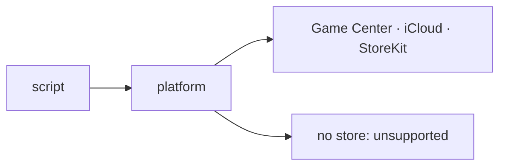

`balaur export` targets iOS, Android and a signed macOS `.app`, and one `platform` module talks to the stores.

{/* truncate */}

- `--target ios` and `--target android` write the app with the game's pack inside, and `--app` builds and signs a Mac `.app`.
- `balaur update` replaces the install with the latest release, checked against its checksums.
- `platform` signs in, unlocks achievements, submits scores, saves to the cloud and sells purchases. On Apple that is Game Center, iCloud and StoreKit.
- With no store loaded, every call answers `unsupported`.

[Shipping a game](/docs/manual/shipping) · [Stores](/docs/manual/stores)
