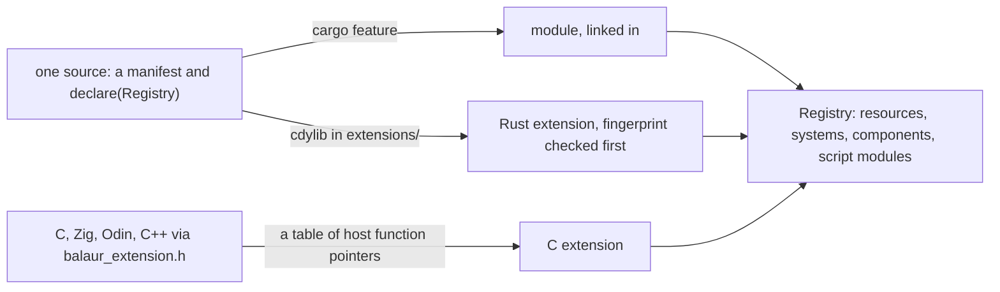

One `Plugin` trait. Linked in behind a cargo feature, it is a module; built
as a shared library and dropped into a project's `extensions/`, it is an
extension. The boundary takes C too.

{/* truncate */}



## What landed

- One trait. A plugin has a manifest and a `declare`: resources,
  systems, components, script modules. `Registry` is deliberately narrow
  and free of generics, because the same operations have to cross a C ABI.
- Modules. `balaur_audio` was the first. Built without it, the binary
  is 19.2 MB against 21.5 MB, and rodio, cpal and the platform audio stack
  are not compiled at all.
- Extensions. `examples/extension_greeter` lives outside the engine
  crates, depends only on `balaur_plugin`, and a game script calls
  `greeter::greet("balaur")` on code the engine never linked against.
- A C API. `examples/extension_c_counter` is the same thing in C: a
  committed header, a table of host function pointers, no allocation across
  the boundary. Anything with a C ABI can write one.

```rust
impl Plugin for Greeter {
    fn manifest(&self) -> &Manifest {
        &self.manifest
    }

    fn declare(&mut self, reg: &mut Registry<'_>) -> anyhow::Result<()> {
        let mut m = reg.script_module("greeter")?;
        m.function("greet", |_: &Engine, name: String| Ok(format!("hello, {name}")));
        Ok(())
    }
}
```

## Refuse before crashing

Rust has no stable ABI, so a library built by a different compiler is
undefined behaviour, not a version error. The first symbol an extension
exports is a `repr(C)` tag of fixed-size fields: rustc, engine version,
registry ABI, and only when all three match does anything Rust-shaped
cross. A mismatch names which one differs.

Extensions load sorted by name and by declared requirements, never by
directory order: load order is registration order, and registration order
is the simulation. [Modules and extensions](/docs/manual/extensions) has
the boundary table.
