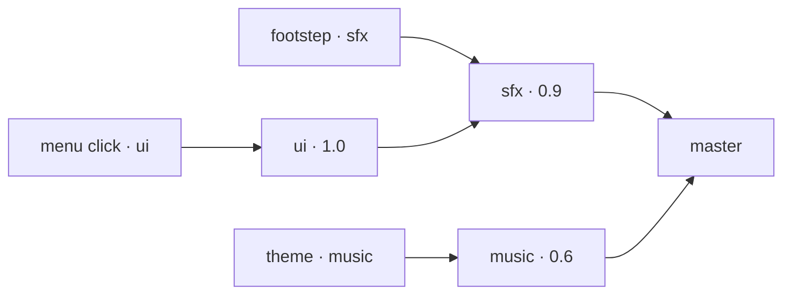

A sound plays through a bus; a bus has a volume and a parent; every chain
ends at `master`. And a sound can have a position.

{/* truncate */}



## What landed

- Buses. Declared in `project.toml`. A sound's gain is its own volume
  times every bus's up to the root, so `audio::set_bus_volume("music",
  0.3)` moves every piece of music at once and nothing else. `master`
  exists whether or not the project declares it.
- Routing per playback. A bus does not own a sound: one file is a
  footstep on `sfx` and a menu click on `ui`.
- Events. `audio::play_event(name, options)` plays a named sound: the
  next of its variations in turn, at its own volume and pitch, through its
  own bus. A `position` in the options places it.
- Positional. A `listener` node is the ears, or `audio::set_listener`
  puts them somewhere by hand. `set_emitter_position` moves what a handle
  plays from, and `distance_gain` says what the distance is costing.

```toml
[audio.buses]
sfx = { volume = 0.9 }
music = { volume = 0.6 }
ui = { volume = 1.0, parent = "sfx" }
```

This is the mixing a game asks for, not a mixing graph: no effects, no
sends. The `audio` module is in the
[script modules reference](/docs/reference/modules).
