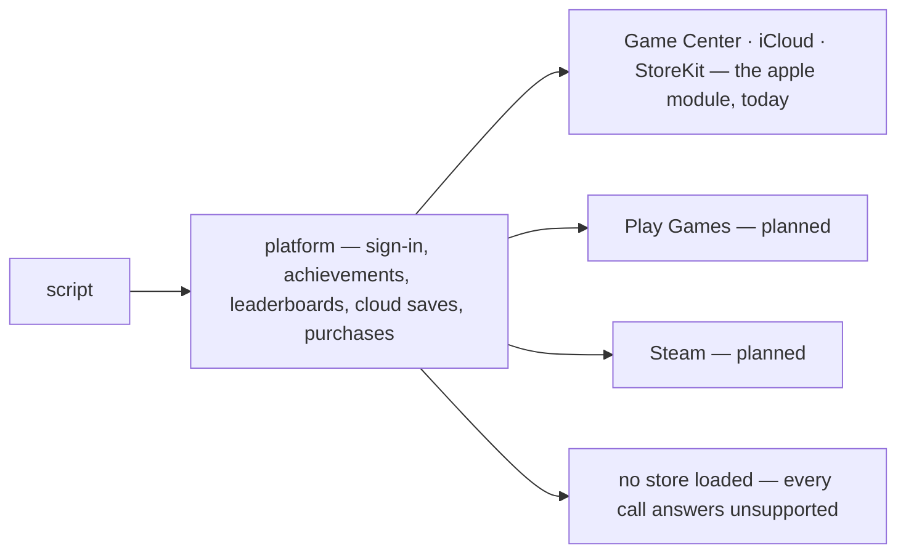

`platform` is one module over every store. A script that unlocks an
achievement says the same thing on Game Center as it will on Play Games
and on Steam. Today the store behind it is Apple's.

{/* truncate */}



## What landed

- **`platform`.** `sign_in`, `unlock`, `progress`, `submit_score`,
  `scores`, `cloud_read`, `cloud_write`, `set_presence`. With no store
  loaded — the editor, a desktop run, a replay — every call answers
  `unsupported` rather than failing, so a script written against it runs
  everywhere.
- **`apple`.** Game Center behind the portable verbs; the iCloud key-value
  store behind `cloud_read`. What only Apple has stays in its own module:
  Sign in with Apple, `identity` for a server to verify, the Game Center
  dashboard and access point.
- **Purchases.** `products`, `purchase`, `entitlements`,
  `restore_purchases` and `finish_purchase`. StoreKit 2 has no Objective-C
  interface, so a small Swift shim is compiled at build time; a machine
  without Swift still builds, and purchases there answer `unsupported`.
- **Arrivals.** Notifications, push tokens, URLs opened, a purchase that
  landed on another device: `apple::watch(node)`, and they reach that node.
- **The export writes the plist.** `[apple]` in `project.toml` — bundle id,
  team, version, capabilities — becomes the `Info.plist` and an
  entitlements file. It refuses what it cannot make work.

```rune
pub async fn init(this) {
    let me = task::wait(platform::sign_in(this.node)).await;
    log::info(`playing as ${me["alias"]}`);
    platform::unlock(this.node, "first_blood");
}
```

An achievement cannot be un-awarded, and a rollback session re-runs
predicted ticks, so a call that changes the store waits until its tick can
no longer be re-run. The engine carries the proof — an identity signature,
a transaction's signed `jws` — and checking it is a server's job.
[Stores](/docs/manual/stores) · [Shipping: Apple](/docs/manual/shipping#apple)
