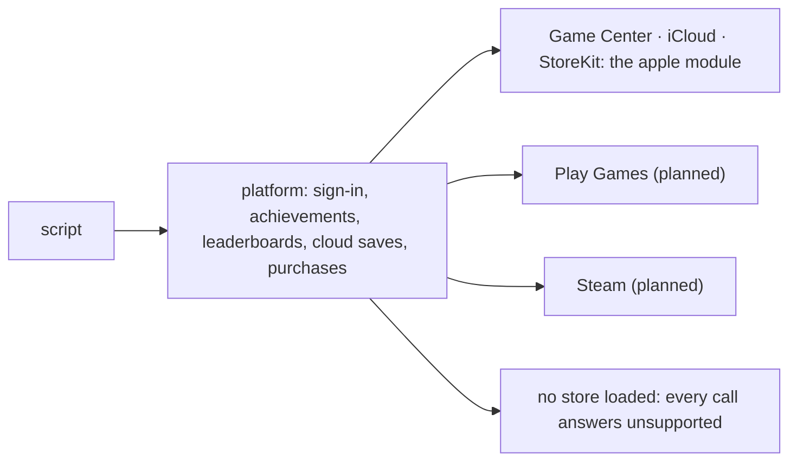

One `platform` module sits over every store: sign-in, achievements,
leaderboards, cloud saves and purchases. Game Center, iCloud and StoreKit are
behind it.

{/* truncate */}



- `platform` has `sign_in`, `unlock`, `progress`, `submit_score`, `scores`,
  `cloud_read`, `cloud_write` and `set_presence`. With no store loaded (the
  editor, a desktop run, a replay) every call answers `unsupported`.
- `apple` puts Game Center behind the portable verbs and the iCloud
  key-value store behind `cloud_read`. The Apple-only calls are Sign in with
  Apple, `identity` for a server to verify, and the Game Center dashboard
  and access point.
- Purchases are `products`, `purchase`, `entitlements`, `restore_purchases`
  and `finish_purchase`. StoreKit 2 is reached through a Swift shim compiled
  at build time. A machine without Swift still builds; purchases there
  answer `unsupported`.
- Notifications, push tokens, opened URLs and a purchase made on another
  device all arrive through `apple::watch(node)`, which delivers them to
  that node.
- `[apple]` in `project.toml` (bundle id, team, version, capabilities)
  becomes the `Info.plist` and an entitlements file on export. An entry it
  cannot honour is refused.

```rune
pub async fn init(this) {
    let me = task::wait(platform::sign_in(this.node)).await;
    log::info(`playing as ${me["alias"]}`);
    platform::unlock(this.node, "first_blood");
}
```

In a rollback session, a call that changes the store waits until its tick
can no longer be re-run. Sign-in returns an identity signature and a purchase
a signed `jws`; a server verifies them.
[Stores](/docs/manual/stores) · [Shipping: Apple](/docs/manual/shipping#apple)
