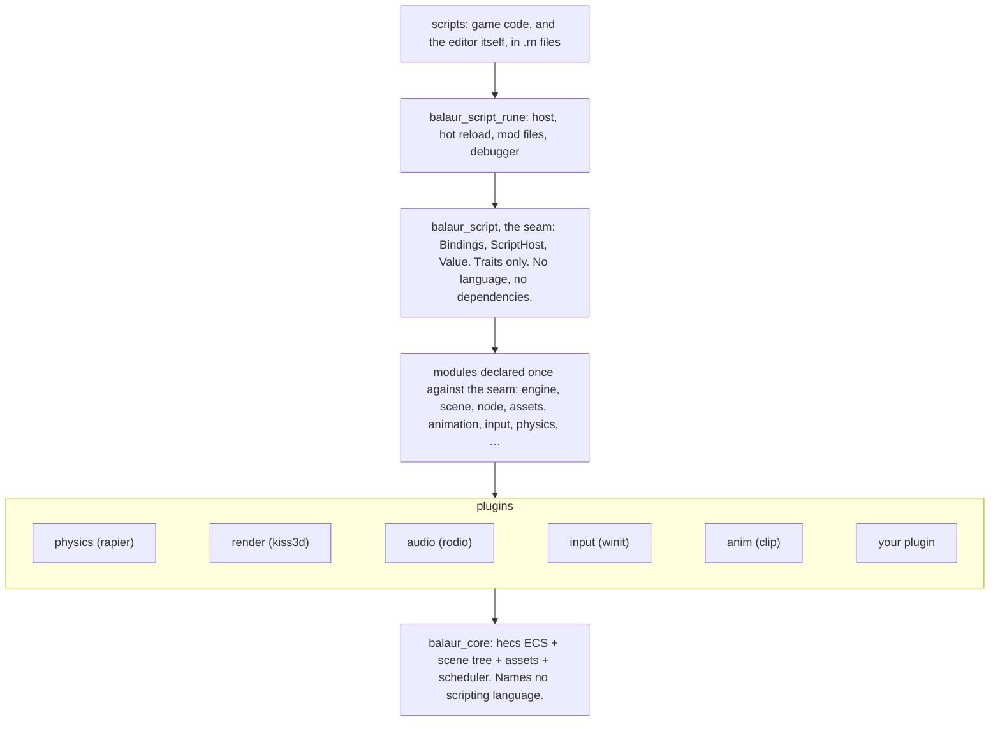
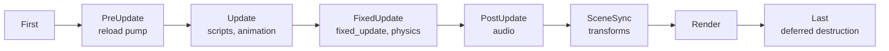

# Architecture

The long version is
[ARCHITECTURE.md](https://github.com/balaurengine/balaur/blob/main/ARCHITECTURE.md)
in the engine repository.

## Layers

Backends depend on core. Core never depends on a backend, and the compiler
enforces the direction.

## ECS

- `hecs`: archetype-based, minimal, no application framework.
- Scheduling, hierarchy and resources are Balaur's own, on top.

## Math

- One crate everywhere: `glamx`, which is glam plus `Pose2`, `Pose3` and
  `Rot2`, re-exporting the rest.
- The same math rapier and kiss3d use, so no layer converts between core,
  physics and rendering.
- Pinned to `libm` and `scalar-math`, so every build gets the deterministic
  math, not only the builds with physics in the graph.

## The `Engine` handle

- One cheaply clonable handle over the world, the resources, the command queue
  and the script host.
- Interior mutability, short borrows.
- Rust systems take it every frame; script bindings capture it. Both sides of
  the FFI see one state, with nothing marshalled between them.
- Single-threaded by design. Threads can later live inside a system without
  changing this facade.

## Scene tree

- A node is an entity carrying `Name`, `Parent`, `Children`, `Transform` and
  `GlobalTransform`.
- Node paths, transform propagation and recursive free are core systems.
- Plugins hang their own components on the same entities.

## The frame

| Rule | |
| --- | --- |
| Fixed step | `FixedUpdate` drains one accumulator into whole 60 Hz steps, zero to four a frame |
| Never the frame time | The simulation is not shown the measured frame time |
| Deferred structure | A script's spawn or free waits for `Last`, so no iteration is invalidated mid-frame |

## The script seam

- `balaur_script` is traits and one neutral `Value`. No language in it, and no
  dependencies.
- A subsystem declares its bindings once against the seam, and never names a
  language.
- A backend implements the host trait and consumes those declarations.
- Rune is the language this build ships. A second one is one crate, and
  changes nothing in physics, input, render, audio or ui.

## Plugins

- Wrapping a Rust crate for scripting is one call per entry point, with
  argument and return conversions inferred.
- One registration buys the scene vocabulary, the runtime component API and
  editor support.
- `balaur_physics` is the reference implementation.
- One `Plugin` trait covers both shipping modes: linked in behind a cargo
  feature, or built as a shared library and loaded at run time. See
  [Modules and extensions](./manual/extensions.mdx).

## The workspace

| Crate | Role |
| --- | --- |
| `balaur_script` | The scripting seam: traits and a neutral value type, no language and no dependencies |
| `balaur_core` | ECS world (hecs), scene tree, scheduler, plugin API, skeletons, glTF and mesh assets, digests, replay, snapshots, pack export |
| `balaur_script_rune` | The Rune backend: host, hot reload, `mod` files, the debugger, export |
| `balaur_physics` | Rapier plugin; the reference example for wrapping a Rust crate for scripting |
| `balaur_render` | Renderable components (shapes, sprites, skinned polygons, meshes) + `render` module; kiss3d/wgpu backend behind a feature flag |
| `balaur_anim` | Animation clips, the pure sampler, tweens, easing, rig modifiers; the `animation` module |
| `balaur_audio` | rodio-backed `audio` module |
| `balaur_input` | Backend-agnostic input snapshot + `input` module |
| `balaur_http` | `http` for scripts, delivered into the simulation per tick |
| `balaur_websocket` | `websocket` for scripts, and a `Transport` for sessions |
| `balaur_webtransport` | QUIC behind the same `Transport`, where a datagram is really a datagram |
| `balaur_gamend` | The Gamend backend (`gamend` module): login, REST, realtime, server hooks |
| `balaur_platform` | The `platform` module and the seam a store plugs into: sign-in, achievements, leaderboards, cloud saves |
| `balaur_apple` | Game Center, iCloud and Sign in with Apple behind that seam, plus `apple` for purchases, notifications and opened URLs |
| `balaur_plugin` | The `Plugin` trait a module or run-time extension implements, plus the loader |
| `balaur_ui` | Immediate-mode egui API (`ui` module): panels, widgets, script-defined themes |
| `balaur` | Batteries-included facade: `standard_app`, `boot_project`, `boot_pack` |
| `balaur_export` | Exporting as a library: packs, fused executables, and the Apple and Android bundles the editor and the CLI both write |
| `balaur_cli` | The `balaur` binary: `new`, `run`, `export`, `play`, `edit`, `import`, `replay`, `api` |
| `balaur_bench` | Headless benchmarks: where a frame's time goes, and what scripting costs |
