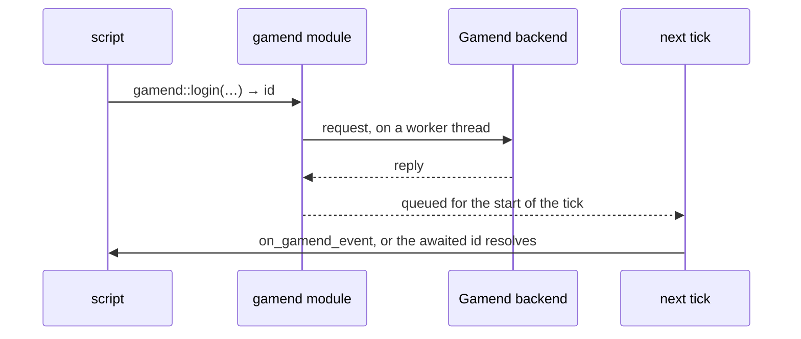

# Gamend

The `balaur_gamend` plugin connects scripts to a Gamend backend through the
`gamend` module: login, REST endpoints, lobbies and server hooks. It is on by
default; building without the `gamend` feature drops it.

- Delivery is the [networking](./networking.mdx) contract: all I/O on worker
  threads, completions entering the simulation once per tick.
- Dispatched to handler methods or waking `await` tokens, in arrival order.
- Handlers never run from an I/O thread. A recorded snapshot replays a whole
  online session.



## The sequential shape

```rune
pub async fn init(this) {
    gamend::configure(()); // [gamend] url: gamend.org unless the project names its own
    let login = task::wait(gamend::login(#{ device_id: "player-1" })).await;
    this.socket = gamend::connect(this.node);
    let hook = task::wait(gamend::call_hook(this.socket, "arena", "start", #{})).await;
}

pub fn on_gamend_event(this, e) {
    // socket events: open / message / closed / error
}
```

- One-shot operations (`login`, `rest`, `call_hook`, `join`, `push`, `leave`)
  wake their returned id and, when given a node, also dispatch to its
  handler.
- Socket events are a stream and only dispatch.
- Every event map carries a `kind`: `login`, `rest`, `reply`, `error`, `open`,
  `message`, `closed`. One handler takes them all.

The full function list is in the
[script modules reference](/docs/reference/modules).

## The server

`gamend::configure()` with no URL reads the project's `[gamend]` settings.

```toml
[gamend]
url = "https://gamend.org"
local_url = "http://localhost:4000"
plugin = "skyrace"
```

- `url` is the server a shipped game talks to. A new project starts on
  `https://gamend.org`.
- `local_url` is a Gamend on your machine, as `mix dev.start` serves it.
- `gamend/target` picks between the two for a game played from the editor.
  It is kept in the editor's own settings, so an exported game always
  reads `url`.
- `configure(url)` with a URL still wins, for a game that picks its server
  at run time.

## The Gamend dock

A project that carries `addons/gamend` gets a Gamend tab in the editor.


- The header switches between the two servers, opens the server and its
  admin site, and says who is signed in.
- Overview, User, Lobby, Data, Activity and Logs read what the played game
  holds: the session, its sockets, and every call with its reply.
- One tab per server feature, from Leaderboards to Hooks, reads that
  feature's `GET` endpoints as trees.
- Tokens are masked, with show and copy.
- The editor uses the game's own user data folder and device id. A game
  played in the editor and run alone share saves and a device sign-in.

## Player prefs

`addons/gamend/prefs.rn` keeps a player's settings on the device, in the
`gamend_prefs` save slot.

```rune
let prefs = script::require("addons/gamend/prefs.rn");
(prefs.set)("music_volume", 0.6);
let volume = (prefs.get)("music_volume", 1.0);
```

Prefs never leave the device. A value that should follow the player to
another device belongs in the server's key-value store.

## Client logs

Each run writes its log to `logs/run.log` in the user data folder and keeps
the last five as `run.1.log` and on. `[log] file` and `[log] keep` set that.

Put `addons/gamend/log_sink.rn` on a node that lives as long as the game to
ship the log to Gamend.

- It asks the server's `/api/v1/client_logs/policy` what to collect, and
  collects nothing until it answers.
- A batch goes at 50 lines, every 10 seconds, and at once on an error.
- A line repeated back to back is sent once with its count.
- Unsent lines are saved, and the next launch sends them with the tail of
  the last log when that run logged an error.
- Every call, the socket and the log batches carry one run id,
  `gamend::run_id()`, so the server shows a run's lines together.
