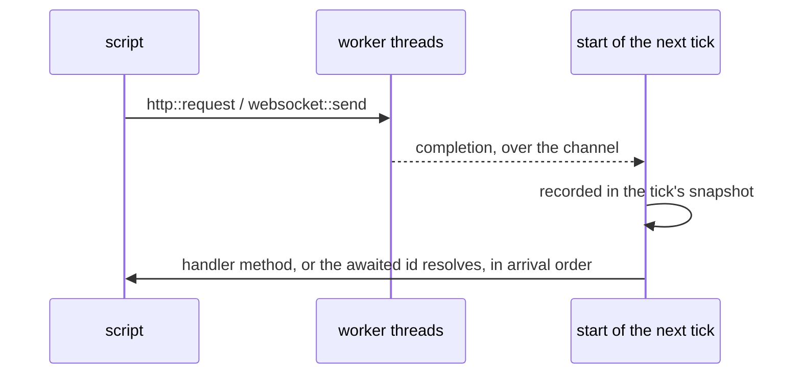

# Networking

| Crate | Protocol | Calls |
| --- | --- | --- |
| `balaur_http` | requests | `http::request` |
| `balaur_websocket` | connections | `websocket::connect`, `send`, `close` |
| `balaur_webtransport` | QUIC | the same `Transport` seam |

All three are on by default, each behind its own feature. Building without
`http` drops the HTTP and TLS stack; without `webtransport` drops QUIC and its
runtime.

:::tip[For multiplayer games]

[Balaur for multiplayer](/multiplayer) puts this delivery model beside the fixed tick, rollback and replay.

:::

## The delivery model



- All I/O runs on background threads.
- Completions cross back over a channel and enter the simulation once per
  tick, at the start of the frame, recorded in a snapshot.
- Input uses the same model. The per-tick snapshot replays a networked
  session.
- Nothing blocks the frame. Handlers never run from an I/O thread.

Scripts never poll. Two shapes:

**Handler methods.** A request or connection names the node that handles its
results, dispatched as method calls:

```rune
pub fn init(this) {
    this.request = http::request(this.node, "https://example.com");
}

pub fn on_response(this, r) {
    log::info(format!("{} {}", r["status"], r["body"]));
}
```

**Sequential await.** A request without a node returns a token the script
suspends on, from an `async` entry point:

```rune
pub async fn init(this) {
    let r = task::wait(http::request(url)).await;
    log::info(format!("{} {}", r["status"], r["body"]));
}
```

The script resumes at the start of a later tick, in arrival order. Given the
same recorded arrivals the result is deterministic. An async entry point
cannot be paused by the [debugger](./scripting.mdx#debugging).

## Options and configuration

```rune
this.socket = websocket::connect(this.node, "wss://game.example/play", #{
    on_event: "on_socket",
    compression: true,
    headers: #{ Authorization: "Bearer " + token },
});
```

```toml
[websocket]
compression = true   # offer permessage-deflate on every connection

[http]
timeout = 10.0       # seconds, for a request that names none
```

- A websocket takes `compression`, which offers `permessage-deflate`
  (RFC 7692) and lets the server decide, and `headers` for the upgrade
  request.
- An HTTP request takes `method`, `body`, `headers` and `timeout`.
- Defaults come from each protocol's table in `project.toml`.
- A call's own option wins over the table.

## Events instead of signals

- A script cannot register a persistent callback and be handed a payload
  three frames later.
- The engine calls a method the script declares by name. A script's own
  events work the same, scoped to an emitting node or to all of them
  ([scripting](./scripting.mdx#events)).
- Most have a polling twin (`input::just_pressed`,
  `animation::just_finished`).
- An event is a frame-scoped snapshot, not a subscription.

For a hosted game backend (auth, storage, lobbies) see
[Gamend](./gamend.mdx), built on the same delivery contract.

## Status

Built: rollback. Two engines exchange only inputs, predict each other, roll
back when a prediction was wrong, and compare a per-tick digest to catch a
desync. It runs over WebSockets or QUIC. On QUIC a datagram is a true
datagram: a lost input costs a misprediction, not a stall.

Missing: replication, RPC, a browser WebTransport backend, WebRTC. The plan is
[PLAN-networking.md](https://github.com/balaurengine/balaur/blob/main/docs/PLAN-networking.md),
with the short form on the [roadmap](../roadmap.mdx). Raw UDP is not planned:
QUIC datagrams cover it, with encryption and a browser story.
