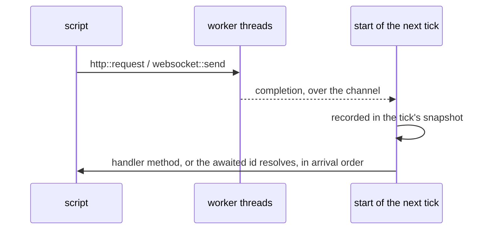

# Networking

One crate per protocol: `balaur_http` for requests (`http::request`),
`balaur_websocket` for connections (`websocket::connect` / `send` / `close`),
`balaur_webtransport` for QUIC. All three are on by default, each behind its
own feature: building without `http` drops the HTTP and TLS stack, without
`webtransport` drops QUIC and its runtime.

:::tip[For multiplayer and simulation]

[Balaur for multiplayer](/multiplayer) puts this delivery model beside the fixed tick, rollback and replay it exists for.

:::

## The delivery model

All I/O runs on background threads. Completions cross back over a channel and
enter the simulation once per tick, at the start of the frame, recorded in a
snapshot: the same model as input, so recording the snapshot per tick is all a
replay of a networked session needs. Nothing blocks the frame, and handlers
never run from an I/O thread.



Scripts never poll. There are two shapes:

Handler methods. A request or connection names the node that handles its
results, dispatched as method calls: the same shape a widget's `on_click` or
an animation method track uses:

```rune
pub fn init(this) {
    this.request = http::request(this.node, "https://example.com");
}

pub fn on_response(this, r) {
    log::info(format!("{} {}", r["status"], r["body"]));
}
```

Sequential await. A request made without a node returns a token the script
suspends on until the result arrives, from an `async` entry point:

```rune
pub async fn init(this) {
    let r = task::wait(http::request(url)).await;
    log::info(format!("{} {}", r["status"], r["body"]));
}
```

The script resumes at the start of a later tick, in arrival order: deterministic given the same recorded arrivals. One limit: an async entry point
cannot be paused by the [debugger](./scripting.mdx#debugging).

## Options and configuration

A websocket takes options beside its handler: `compression` offers
`permessage-deflate` (RFC 7692) and lets the server decide, and `headers` go on
the upgrade request. An HTTP request takes `method`, `body`, `headers` and
`timeout` the same way.

```rune
this.socket = websocket::connect(this.node, "wss://game.example/play", #{
    on_event: "on_socket",
    compression: true,
    headers: #{ Authorization: "Bearer " + token },
});
```

Defaults come from each protocol's table in `project.toml`, so a project can
turn compression off everywhere, or shorten every timeout, without touching a
script:

```toml
[websocket]
compression = true   # offer permessage-deflate on every connection

[http]
timeout = 10.0       # seconds, for a request that names none
```

A call's own option wins over the table.

## Why there are no signals

A script cannot register a persistent callback and be handed a payload three
frames later. That would need an id space with explicit release. Events go the
other way: the engine calls a method the script declares by name, and a script's
own events work the same, scoped to an emitting node or to all of them
([scripting](./scripting.mdx#events)). Most also
have a polling twin (`input::just_pressed`, `animation::just_finished`) for
scripts that would rather ask than declare a method. An event is a frame-scoped
snapshot, not a subscription.

For a hosted game backend (auth, storage, realtime rooms) see
[Gamend](./gamend.mdx), built on the same delivery contract.

## What is not there yet

Rollback works: two engines exchange only inputs, predict each other, roll
back when a prediction was wrong, and compare a per-tick digest to catch a
desync. It runs over websockets or QUIC, and on QUIC a datagram is a real one,
so a lost input costs a misprediction rather than a stall.

Missing: replication, RPC, a browser WebTransport backend, and WebRTC. The rest
of the plan is
[PLAN-networking.md](https://github.com/balaurengine/balaur/blob/main/docs/PLAN-networking.md)
in the engine repository, with the short form on the
[roadmap](../roadmap.mdx). Raw UDP is not coming: QUIC datagrams cover it, with
encryption and a browser story.
