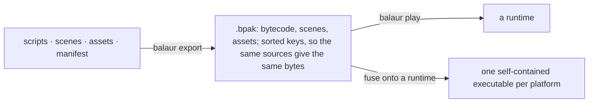

# Shipping a game



## Packs

```bash
balaur export my-game        # writes my-game.bpak
balaur play my-game.bpak     # run from bytecode only
```

- Every script is compiled to bytecode with dev mode's compiler configuration
  and bundled with the scenes and the manifest.
- A packed run has no compiler, no file watcher and no script sources.
- A pack is written in sorted key order. The same sources give the same bytes
  on any machine.
- TOML assets, animation clips and every other registered type resolve by the
  same references as a dev run.
- Binary assets are in the same pack, each verified against its SHA-256 on
  load.
- Packed execution interprets precompiled bytecode, with no JIT. CI
  cross-compiles to iOS, Android and WebAssembly on every push.

## Fused executables

```bash
balaur export my-game --target linux-x64     # or macos-universal, windows-x64
```

- Fusing appends the pack and a trailer to a runtime template, the engine
  binary published per platform. ELF, Mach-O and PE ignore trailing bytes.
- On startup the engine reads its own executable: a pack inside means a
  shipped game, none means the CLI. One binary is the editor, the CLI and
  every game's runtime.
- The host platform's template ships with the editor download, in
  `templates/`.

| Getting another platform's template | How |
| --- | --- |
| Download | `balaur export` offers to fetch it from the engine's release tag, verified against `SHA256SUMS`, into a per-user cache (`<data dir>/balaur/templates/<version>`) |
| Without a prompt | `--download`, or `--no-download` to forbid fetching (CI) |
| By hand | drop a `balaur-runtime-*` binary into `templates/`, point `BALAUR_TEMPLATES` at a directory, or pass `--template <file>` |

A template is pinned to the compiler version that wrote the pack.

- A flat fused binary cannot be code-signed. For a signed macOS game,
  `balaur export my-game --target macos-universal --app` builds a `.app` with
  the pack as a sealed resource and signs it ad-hoc.
  `--sign "Developer ID Application: …"` uses a real identity.
- The exporter sets the execute bits on its output.

## Mobile

```bash
balaur export my-game --target ios       # -> my-game.app
balaur export my-game --target android   # -> my-game-android/ (an APK layout)
```

- The pack is inside the bundle: `game.bpak` beside the executable in an
  `.app`, `assets/game.bpak` in an APK.
- `balaur export` signs with the project's certificate or keystore. iOS:
  `--sign <identity>` and `--profile <file>`, plus `--ipa` for App Store
  Connect.
- Android: `--apk` assembles and signs with the keystore
  `[export] android_keystore` names, or Android's debug identity when none is
  named.
- Without those flags the build is unsigned and installs on no device.

## Web

```bash
balaur export my-game --target web       # -> my-game-web/
```

- A directory for a static host: the wasm-bindgen glue, the engine module, the
  pack, and a page that loads them.
- A `web/index.html` in the project replaces the page.
- The module is the same for every game and most of the download. See
  [Build size](./build-size.mdx).

## Apple

An `.app` is written from the `[apple]` table.

```toml
[apple]
bundle_id = "com.studio.game"    # the identifier registered in App Store Connect
team = "AB12CD34EF"              # the ten-character team identifier
version = "1.2"                  # CFBundleShortVersionString
build = "7"                      # CFBundleVersion
min_os = "15.0"                  # iOS; min_macos for the Mac
capabilities = ["game-center", "icloud-kv", "in-app-purchase"]

[apple.plist]                    # anything else the bundle needs, as written
ITSAppUsesNonExemptEncryption = false
```

```bash
codesign --entitlements my-game.entitlements --sign "Apple Distribution: …" my-game.app
```

- The exporter writes the whole `Info.plist` from that table, plus a
  `<game>.entitlements` holding one key per capability.
- It refuses a capability with no `bundle_id`, an `icloud-kv` with no `team`
  (nothing expands `$(TeamIdentifierPrefix)` outside Xcode), or a deployment
  target below what a capability's API needs.
- A macOS `.app` is signed on export, entitlements included; `--sign` is the
  whole step.
- The capabilities are in [Stores](./stores.mdx). Running this on a runner is
  in [Continuous integration](./ci.mdx).

## Updates

`balaur update` replaces the whole install as a set: the binary, the bundled
editor and its runtime template.

- Verified against the release's checksums.
- A tagged release updates to the newest release, a nightly follows the
  rolling nightly, and a source build refuses and points at git.
- `--check` only reports. `--tag` picks a release.

## Save games

```toml
[save]
version = 3                     # what this build writes
migrate = "scripts/saves.rn"    # brings an older file forward
```

| Call | What it does |
| --- | --- |
| `save::write(slot, data)` | stores a table per user, under the platform's user-data directory |
| `save::read(slot)` | brings it back |
| `save::slots()` | lists them |
| `save::remove(slot)` | deletes one |

- A slot name is letters, digits, `-` and `_`, and is validated.
- A file is written beside its target and renamed over it.
- Every file is stamped with the build's `version`. Reading an older one calls
  `migrate_save(version, data)` once per step, 1 to 2 then 2 to 3.
- A file written by a newer build is refused.
- Other per-user data (settings, key rebindings) goes through
  `engine::user_data_dir()`.

## Embedding

```rust
fn main() -> anyhow::Result<()> {
    balaur::boot_pack(include_bytes!("game.bpak"))
}
```

Embedding needs a Rust toolchain. Fused export does not.
