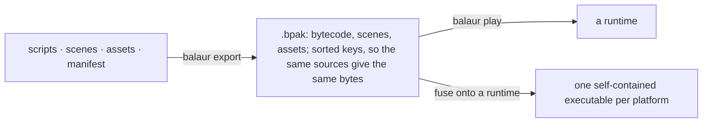

# Shipping a game



## Packs

```bash
balaur export my-game        # writes my-game.bpak
balaur play my-game.bpak     # run from bytecode only
```

- Every script is compiled to bytecode with the same compiler configuration
  dev mode uses, and bundled with the scenes and the manifest.
- A packed run builds no compiler and no file watcher, and no script sources
  exist in the shipped build.
- A pack is written in sorted key order, so exporting the same sources twice
  gives the same bytes on any machine. Reproducible builds and content-change
  checks follow from that.
- TOML assets, animation clips and every other registered type, resolve by the
  same references a dev run uses.
- Binary assets ride in the same pack, each verified against its SHA-256 when
  loaded.
- Packed execution is pure interpretation of precompiled bytecode, so it ships
  where JIT is restricted. CI cross-compiles to iOS, Android and WebAssembly
  on every push to keep that true.

## Fused executables

```bash
balaur export my-game --target linux-x64     # or macos-universal, windows-x64
```

- Fusing appends the pack to a runtime template, the engine binary published
  per platform, and writes a trailer. ELF, Mach-O and PE all ignore trailing
  bytes, so the file still runs.
- On startup the engine reads its own executable. A pack inside means a
  shipped game; nothing means the CLI. One binary is the editor, the CLI and
  every game's runtime.
- Your own platform's template ships with the editor download, in
  `templates/`.

| Getting another platform's template | How |
| --- | --- |
| Download | `balaur export` offers it from the engine's release tag, verified against `SHA256SUMS`, into a per-user cache (`<data dir>/balaur/templates/<version>`, never inside a project) |
| Without a prompt | `--download`, or `--no-download` to forbid fetching, for CI |
| By hand | drop a `balaur-runtime-*` binary into `templates/`, point `BALAUR_TEMPLATES` at a directory, or pass `--template <file>` |

The version pinning is deliberate: a pack must only meet the runtime its
compiler shipped with.

Two practical notes:

- A flat fused binary cannot be validly code-signed, because appending is
  exactly what a signature cannot cover. For a signed macOS game, export a
  bundle: `balaur export my-game --target macos-universal --app` builds a
  `.app` with the pack as a sealed resource and signs it ad-hoc, and
  `--sign "Developer ID Application: …"` uses a real identity.
- The exporter sets the execute bits on its output, because templates that
  came through a zip or a CI artifact store usually lost theirs.

## Mobile

```bash
balaur export my-game --target ios       # -> my-game.app
balaur export my-game --target android   # -> my-game-android/ (an APK layout)
```

- Neither mobile OS runs a bare executable, so the pack rides inside the
  bundle: `game.bpak` beside the executable in an `.app`, `assets/game.bpak`
  in an APK.
- Signing is `balaur export`'s own, with your certificate or keystore. On iOS,
  `--sign <identity>` and `--profile <file>`, plus `--ipa` for the shape App
  Store Connect takes.
- On Android, `--apk` assembles and signs with the keystore
  `[export] android_keystore` names, or Android's debug identity when the
  project names none.
- Without those flags a build comes out unsigned, which installs on no device.

## Web

```bash
balaur export my-game --target web       # -> my-game-web/
```

- A directory for a static host: the wasm-bindgen glue, the engine module, the
  pack, and a page that loads them.
- A `web/index.html` in the project replaces the page.
- The module is the same for every game and is most of what a player
  downloads. See [Build size](./build-size.mdx).

## Apple

Every Apple service resolves against the bundle rather than the code, so an
`.app` is written from the `[apple]` table.

```toml
[apple]
bundle_id = "com.studio.game"    # the identifier registered in App Store Connect
team = "AB12CD34EF"              # the ten-character team identifier
version = "1.2"                  # CFBundleShortVersionString
build = "7"                      # CFBundleVersion
min_os = "15.0"                  # iOS; min_macos for the Mac
capabilities = ["game-center", "icloud-kv", "in-app-purchase"]

[apple.plist]                    # anything else the bundle needs, as written
ITSAppUsesNonExemptEncryption = false
```

```bash
codesign --entitlements my-game.entitlements --sign "Apple Distribution: …" my-game.app
```

- The exporter writes the whole `Info.plist` from that table, plus a
  `<game>.entitlements` holding one key per capability.
- It refuses what it cannot make work: a capability with no `bundle_id`, an
  `icloud-kv` with no `team` (nothing expands `$(TeamIdentifierPrefix)`
  outside Xcode), or a deployment target below what a capability's API needs.
- A macOS `.app` is signed as it is exported, entitlements included, so
  `--sign` is the whole step there.
- What the capabilities are for is in [Stores](./stores.mdx). Running this on
  a runner is [Continuous integration](./ci.mdx).

## Keeping the install current

`balaur update` replaces the whole install, which only works as a set: the
binary, the bundled editor and its runtime template.

- Verified against the release's checksums.
- A tagged release updates to the newest release, a nightly follows the
  rolling nightly, and a source build refuses and points at git.
- `--check` only reports. `--tag` picks a release.

## Save games

```toml
[save]
version = 3                     # what this build writes
migrate = "scripts/saves.rn"    # brings an older file forward
```

| Call | What it does |
| --- | --- |
| `save::write(slot, data)` | stores a table per user, under the platform's user-data directory |
| `save::read(slot)` | brings it back |
| `save::slots()` | lists them |
| `save::remove(slot)` | deletes one |

- A slot name is letters, digits, `-` and `_`, checked rather than trusted.
- A file is written beside its target and renamed over it, so a crash mid-save
  cannot leave a truncated one.
- Every file is stamped with the build's `version`. Reading an older one calls
  `migrate_save(version, data)` once per step, 1 to 2 then 2 to 3, so a
  migration only knows how the shape changed between two adjacent versions.
- A file written by a newer build is refused rather than misread.
- Anything else kept per user, settings or key rebindings, goes through
  `engine::user_data_dir()`, so game code never hardcodes an OS path.

## Embedding

```rust
fn main() -> anyhow::Result<()> {
    balaur::boot_pack(include_bytes!("game.bpak"))
}
```

Embedding needs a Rust toolchain on the machine doing the shipping. Fused
export exists so editor users do not.
