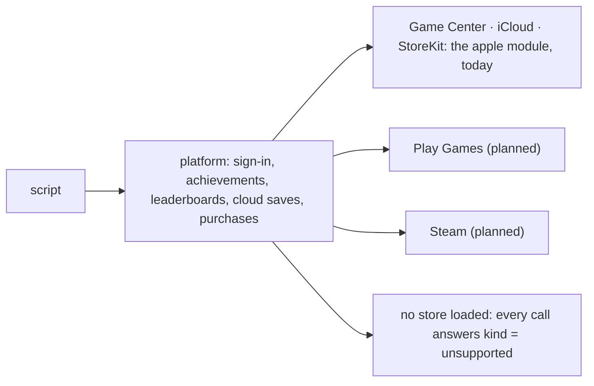

# Stores

The `platform` module is one script API over every store.

- One call unlocks an achievement on Game Center, Play Games and Steam.
- What only one platform has lives in that platform's module: `apple`.
- With no store loaded (the editor, a desktop run, a replay) every call
  answers `kind = "unsupported"`.



```rune
pub async fn init(this) {
    let me = task::wait(platform::sign_in(this.node)).await;
    log::info(`playing as ${me["alias"]}`);
    platform::unlock(this.node, "first_blood");
}

pub fn on_platform(this, e) {
    if e["kind"] == "signed_out" {
        // The player signed out in the OS. The node that signed in hears it.
    }
}
```

- Delivery is the [networking](./networking.mdx) and [Gamend](./gamend.mdx)
  contract. A call returns an id at once. The store answers on a later tick,
  to the node's `on_platform` method and to whoever awaits the id.
- Every event carries a `kind`: `signed_in`, `signed_out`, `done`, `scores`,
  `read`, `failed`, `unsupported`. One handler takes them all.

## The portable module

| Call | What it does |
| --- | --- |
| `sign_in`, `player`, `signed_in` | Who is playing. The node given to `sign_in` stays subscribed: a later sign-out reaches the same method |
| `unlock`, `progress` | Award an achievement, or report progress on it |
| `submit_score`, `scores` | Post to a leaderboard, and read it: `scope`, `period`, `count` and `start` in the options |
| `cloud_read`, `cloud_write` | A value the store syncs between the player's devices |
| `set_presence` | What the player is doing, where the store shows it |

A store without one of these answers `unsupported`: Game Center has no
presence.

## Achievements and rollback

- An achievement cannot be un-awarded. A [rollback](./determinism.mdx) game
  can re-run a predicted tick with different inputs.
- A call that changes the store waits until the tick that made it can no
  longer be re-run.
- Reads never wait. Repeating one costs a round trip.
- Without a rollback session every tick is final at once.

## Apple

The `apple` feature puts Game Center behind the portable calls and adds the
`apple` module.

| Portable call | On an Apple platform |
| --- | --- |
| `platform::sign_in` | Game Center, including its sign-in sheet |
| `platform::unlock`, `progress` | `GKAchievement` |
| `platform::submit_score`, `scores` | `GKLeaderboard` |
| `platform::cloud_read`, `cloud_write` | The iCloud key-value store |

Apple only:

```rune
pub async fn init(this) {
    apple::watch(this.node);                              // arrivals nobody asked for
    let proof = task::wait(apple::identity()).await;      // for the server to check
    apple::show_dashboard(this.node, #{ state: "leaderboards" });
    apple::access_point(true, #{ location: "top_trailing" });
}
```

- `apple::identity` fetches the url, signature, salt and timestamp a server
  needs to verify a Game Center player.
- `apple::sign_in` is Sign in with Apple, a separate account from Game
  Center's. It answers with an identity token and an authorization code. The
  player's name comes once, on the first authorization; save it then.
  `apple::credential_state` says whether a saved account is authorized,
  revoked or transferred.
- `apple::show_dashboard` and `apple::access_point` are Game Center's own
  screens.
- Purchases: `apple::products`, `purchase`, `entitlements`,
  `restore_purchases` and `finish_purchase`.
- Arrivals: `apple::request_notifications`, `notify`, `cancel_notification`,
  `register_for_push` and `watch_urls`. A tapped notification, an opened URL,
  a push token or a purchase from another device reaches the nodes registered
  through `apple::watch`.

The engine never decides who a player is or whether a purchase counts. It
carries the proof (an identity signature, an identity token, a transaction's
signed `jws`) for a server such as [Gamend](./gamend.mdx) to check.

### Buying

```rune
pub async fn init(this) {
    let found = task::wait(apple::products(["com.studio.game.coins"])).await;
    this.purchase = apple::purchase(this.node, "com.studio.game.coins");
}

pub fn on_apple(this, e) {
    if e["kind"] == "purchased" {
        // Send e["jws"] to your server. Once it has granted the thing:
        apple::finish_purchase(e["id"]);
    }
}
```

- A purchase is not finished when it lands. StoreKit re-delivers an
  unfinished transaction on every launch.
- `finish_purchase` is a separate call, made after the server that checked
  the `jws` has granted the purchase.
- The engine carries a small Swift shim, compiled at build time: StoreKit 2
  has no Objective-C interface.
- A machine without a Swift toolchain still builds the engine. Purchases
  there answer `unsupported`.

## Export declarations

Apple resolves each of these services against the bundle. A game declares
them in `project.toml`; `balaur export` writes the `Info.plist` and the
entitlements file from it. See [Shipping](./shipping.mdx#apple).

The full function list is in the
[script modules reference](/docs/reference/modules).
